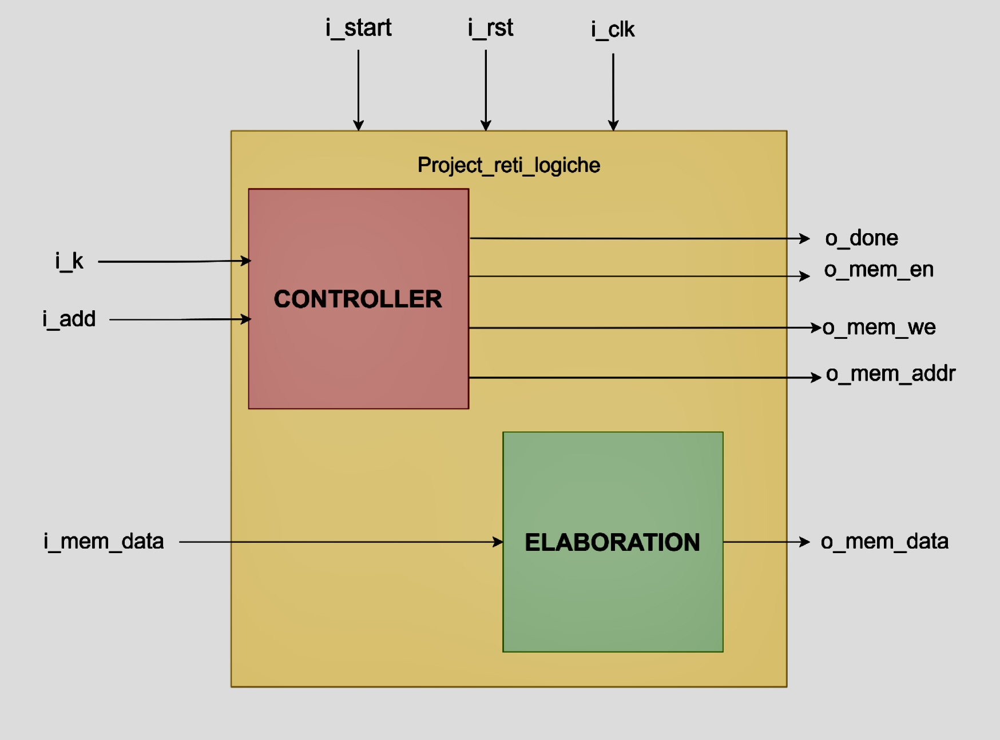

# VHDL Hardware Module — RAM with Credibility Index

> Final project for *Reti Logiche* (Politecnico di Milano, A.Y. 2023/2024) — **Emanuele Lovino**

> Final mark: 30 CUM LAUDE

This repository provides a VHDL implementation of a **RAM-like module augmented with a credibility index** that tracks the reliability (“freshness”) of each stored datum and updates it online during processing.

## Overview

The module processes a sequence of **K 8-bit words** (`W`) starting from a **16-bit base address**.  
For each position, an associated **8-bit credibility `C`** is maintained in memory:

- If **`W ≠ 0`**: the credibility **`C ← 31`** (default), and `W` is written.
- If **`W = 0`**: the **last valid word** is rewritten, and its credibility is **decremented by 1** (saturating at 0).

Execution starts when `START` is asserted and stops either when the sequence is completed or if `RESET` is asserted. A new run begins with a new `START`.

---

## Specifications

- **Data width**: 8 bits  
- **Addressing**: 16 bits (byte addressing)  
- **Sequence length**: `K` is 10 bits (latched at `START`/`RESET`)  
- **Memory layout**: after each `W`, the following byte stores its credibility `C`  
- **Termination**: on end of sequence or asynchronous `RESET`  
- **Behavior on input zeros**: rewrite last valid `W`, decrease `C` by 1 (down to 0)

---

## Component Interface

- `i_clk` — clock signal  
- `i_rst` — reset signal (initializes the machine)  
- `i_start` — start signal (from memory/testbench)  
- `i_add[15:0]` — first memory address of the input sequence (latched at `START/RESET`)  
- `i_k[9:0]` — sequence length `K` (latched at `START/RESET`)  
- `i_mem_data[7:0]` — data read from memory on read cycles  
- `o_mem_data[7:0]` — data to be written to memory on write cycles  
- `o_mem_en` — memory enable (required for both read and write)  
- `o_mem_we` — write enable (`1` = write, `0` = read)  
- `o_mem_addr[15:0]` — current memory address used for operations  
- `o_done` — asserted when the sequence completes while `START` is high

---

## Architecture & Design Choices

The top entity `project_reti_logiche` is organized as **two concurrent, synchronized processes**, each modeled as an **FSM**:

### VHDL Approach

- **Behavioral** modeling was chosen to keep the description abstract and readable.  
- The split into two FSMs improves **testability**, **modularity**, and **synchronization** control.

### Controller FSM

Responsibilities:
- Latch `i_add` and `i_k` into internal registers (`add_reg`, `k_reg`), and keep a **`counter`**.  
- Drive memory control signals: `o_mem_en`, `o_mem_we`.  
- Manage **read/write** cycles and address updates (`o_mem_addr`).  
- Raise `o_done` when `counter == k_reg - 1`.  
- Use **synchronization states** (`SYNC_1`, etc.) to coordinate with ELABORATION and to handle back‑to‑back runs safely.

**Controller States (6):**
- `SET_UP` — initialize control regs, address, and counter after `RESET`.  
- `IDLE` — wait for `START`; latch `i_k`, `i_add`; assert `o_mem_en`.  
- `SYNC_1` — controller–elaboration synchronization.  
- `MEM_READ` — perform read cycles.  
- `MEM_WRITE` — perform write cycles; increment counter/address or go to `DONE`.  
- `DONE` — assert `o_done` while `START` is high; de‑assert on `START` low and return to `SET_UP`.

### Elaboration FSM

Responsibilities:
- Read incoming bytes (`i_mem_data`), keep **last valid word** in `reg`.  
- Maintain and output **credibility `C`**.  
- On `W ≠ 0`: `reg ← W`, `C ← 31`.  
- On `W = 0`: output `reg` and **decrement `C`** (bounded at 0).  
- Coordinate with Controller via **`SYNC`** states.

**Elaboration States (9):**
- `IDLE_1` — initial state; return here on `RESET` or `START` low.  
- `SYNC_FIRST` — first‑run synchronization.  
- `ELAB_FIRST_DATA` — wait for first `W ≠ 0`; store in `reg`; set `C ← 31`.  
- `SYNC_2` — sync with Controller’s `SYNC_1`.  
- `OUT_C` — output credibility `C` (expecting the `C` position in memory).  
- `WAIT_WRITE_C` — wait for memory write of `C`.  
- `SYNC_3` — sync with Controller’s `SYNC_1`.  
- `ELAB_DATA` — main loop: process `W`, update `reg`/`C`.  
- `WAIT_WRITE_D` — wait for memory write of the processed data; then return to `SYNC_2`.

### Block Diagram

---

## Experimental Results

Synthesis and timing (Xilinx flow):

- **Flip‑flops used**: **71**  
- **LUTs used**: **84**  
- **Latches used**: **0**  
- **Worst Negative Slack (w.r.t. 20 ns)**: **14.903 ns**  
- **Critical data path delay**: **≈ 4.715 ns** → **Fmax ≈ 212.1 MHz**

Observations:
- The longest path is **well below** the 20 ns target.  
- Delay composition indicates routing dominates the critical path; physical clustering could further reduce it.  
- Synchronization states were intentionally kept for robustness under **multi‑input** scenarios.

---

## Simulation

- **Types**: Behavioral and Post‑Synthesis (**Functional** & **Timing**).  
- **Clock‑period stability (timing sim)**: **≈ 3.8–20 ns**.  
- **Test cases** included:
  - **Empty input** (all zeros) coverage.  
  - **Credibility saturation** (ensure `C` does not go below 0).  
  - **Reset recovery** (resume correctly after `RESET`).  
  - **Multi‑input sequences** without `RESET` (critical scenario).

Design change discovered and applied:
- A corner case where `START` and the **first address** were applied **simultaneously** caused a stale read on `i_mem_data` at the very first cycle.  
- **Fix**: add a `SET_UP` stage in the Controller to delay the transition to `IDLE` by two cycles, ensuring correct alignment of reads/writes across consecutive runs.

---

## Author

**Emanuele Lovino**  
MSc High‑Performance Computing Engineering — Politecnico di Milano  
📧 emanuele.lovino@mail.polimi.it  
🔗 https://www.linkedin.com/in/emanuele-lovino-98b47a265/

---

## License

Distributed under the **MIT License**.
